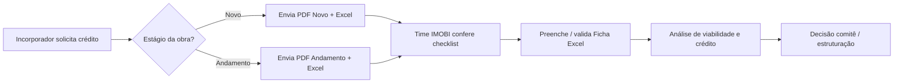

# Análise de crédito — documentos e viabilidade de obra

**Contexto:** processo manual offline hoje. O incorporador envia PDF (checklist) + Excel (Ficha). A IMOBI usa isso para viabilizar análise de crédito antes de estruturar operação na plataforma.

**Templates no repositório:** `docs/analise-credito/templates/`

**Checklist estruturado (futuro wizard):** `docs/analise-credito/checklist-por-estagio.json`

---

## 1. Visão geral dos três arquivos

| Artefato | Função | Quando usar |
|----------|--------|-------------|
| **Empreendimento - Novo.pdf** | Lista o que pedir para **obra nova** (pré-obra / lançamento) | Entrada antes ou no início da obra |
| **Empreendimento - Em Andamento.pdf** | Lista o que pedir com **obra já iniciada** | Entrada com medição, custos e cronograma real |
| **Ficha do Empreendimento e Viabilidade IMOBI.xlsx** | Dados estruturados do empreendimento + EVEF + unidades + carteira + portfólio do grupo | **Sempre** — complementa ambos os PDFs |

Regra operacional: material com **data-base atualizada**; formatos preferidos **PDF** (documentos) e **Excel** (planilhas).

---

## 2. Estágios de entrada na obra

A IMOBI pode entrar em **diversas etapas** do ciclo da obra. O checklist muda conforme o estágio:

```
┌─────────────────┐     ┌──────────────────────┐     ┌─────────────────────┐
│  NOVO           │     │  EM ANDAMENTO        │     │  ENTRADA TARDIA     │
│  0% físico      │────▶│  1% – 99% físico     │────▶│  % alto (ex. 30%+)  │
│  Checklist Novo │     │  Checklist Andamento │     │  Andamento + reforço│
└─────────────────┘     └──────────────────────┘     └─────────────────────┘
```

| Estágio | Critério prático | Checklist PDF | Complemento |
|---------|-------------------|---------------|-------------|
| **Novo** | Obra não iniciada ou só licenciamento | Novo | DRE 3 anos + organograma + histórico incorporador |
| **Em andamento** | Obra iniciada, medição e custos reais | Em Andamento | Posição de caixa SPE, carteira, distratos, comparativo planejado x realizado |
| **Entrada tardia** | Crédito com obra já avançada | Em Andamento | Reforçar itens 11–14 (engenharia) e 20–22 (financeiro); laudo de terceiro recente |

Na plataforma (futuro): primeiro passo do fluxo = **“Em qual etapa está a obra?”** → checklist dinâmico.

---

## 3. Checklist — obra NOVA (`Empreendimento - Novo.pdf`)

### 01 Terreno (itens 1–5) — comum a todos os estágios

1. Matrícula atualizada (máx. 30 dias)
2. Certidão negativa de ônus e gravames
3. Instrumento de aquisição (compra, permuta, etc.)
4. Laudo de avaliação do terreno
5. Zoneamento, índices construtivos, recuos e restrições

### 02 Projeto (itens 6–10)

6. Relação de unidades (status, m², valor)
7. Projeto aprovado (plantas e cortes)
8. Especificações de acabamentos e padrão
9. Book comercial + apresentação da incorporadora
10. **Cronograma físico-financeiro previsto** (etapas, prazos, curva de desembolso **planejada**)

### 03 Acordo permutas + fluxo projetado (itens 11–12)

11. Acordo formal sobre permutas (não concorrência), se houver
12. Fluxo mensal, necessidade de capital, ponto de equilíbrio, cenários pessimista/base/otimista

### 04 Licenciamento (itens 13–14)

13. Alvará válido para início da obra
14. Licenças LP/LI quando exigíveis

### 05 Carteira + EVEF (item 15)

15. Posição analítica da carteira (contrato, unidade, parcelas, vencimento x pagamento, amortização Price/SAC/SACOC)

### 06 Demonstrações financeiras — **somente NOVO** (item 16)

16. Balanço e DRE dos **últimos 3 exercícios** da incorporadora (preferencialmente assinados por contador)

### 07 Organograma e histórico — **somente NOVO** (itens 17–18)

17. Estrutura societária do grupo e posição da SPE
18. Obras entregues, atrasos, distratos, processos judiciais relevantes

---

## 4. Checklist — obra EM ANDAMENTO (`Empreendimento - Em Andamento.pdf`)

### 01 Terreno (itens 1–5)

Idêntico ao checklist Novo.

### 02 Projeto e engenharia (itens 6–14)

6–9. Iguais ao Novo (unidades, projeto aprovado, acabamentos, book)

10. **Cronograma físico-financeiro atualizado** (% executado, custos incorridos/a incorrer, curva até conclusão)

**Complementos exclusivos de obra em andamento:**

11. % obra executado medido por **terceiro independente**
12. Status da obra, riscos, desvios de prazo e orçamento
13. Comparativo **planejado x realizado** e novo prazo de entrega
14. Custo original, custo atualizado e **saldo para conclusão**

### 03 Comercial e financeiro (itens 15–22)

15. Acordo sobre permutas (se houver)
16. Fluxo mensal, capital, ponto de equilíbrio, cenários
17. Unidades vendidas e em estoque (data-base)
18. Carteira ativa, inadimplência e distratos
19. Vendas brutas menos cancelamentos (velocidade real)
20. Planilha integrada: terreno, obra realizada/restante, vendas recebidas, financiamento, capital adicional
21. Saldo de caixa, aplicações e dívidas da SPE
22. Posição com bancos, fornecedores, tributos e ações trabalhistas

### 04 Licenciamento (itens 23–24)

23. Alvará válido
24. Licenças LP/LI quando exigíveis

### 05 Carteira + EVEF (item 25)

25. Posição analítica da carteira (mesmo detalhamento do item 15 do Novo)

---

## 5. Diferença resumida: Novo vs Em andamento

| Tema | Obra nova | Obra em andamento |
|------|-----------|-------------------|
| Cronograma (item 10) | Previsto / planejado | Atualizado + realizado |
| Engenharia (11–14) | Não exige | **Obrigatório** |
| Comercial operacional (17–22) | Não exige (só fluxo projetado) | **Obrigatório** |
| DRE incorporadora (16) | **Obrigatório** | Não listado no PDF |
| Organograma + histórico (17–18) | **Obrigatório** | Não listado no PDF |
| Numeração licenciamento | 13–14 | 23–24 |
| Numeração EVEF | 15 | 25 |

**Complemento se a obra for nova:** enviar seções **06** e **07** do PDF Novo (DRE + organograma/histórico). Se a obra já estiver em andamento, trocar pelo bloco **02 (11–14)** e **03 (15–22)** do PDF Em Andamento.

---

## 6. Planilha Excel — estrutura e mapeamento

Arquivo: `Ficha do Empreendimento e Viabilidade IMOBI.xlsx`

### Aba: Ficha do Empreendimento

Duas colunas lógicas:

**Coluna “O Projeto”** — cadastro e físico:

- Identificação: nome, SPE, CNPJ, sócios, website, localização, tipo (incorporação/loteamento)
- Terreno: área matrícula, área construída, valor terreno, área total
- Comercial: valor médio unidades, valor m², VGV
- Datas: lançamento, início obras, término previsto, habite-se/TVO
- Garantias: patrimônio de afetação, alienação fiduciária (prevista/registrada)
- Unidades: lançadas, venda a prazo, quitadas, estoque, permuta; valores recebido/a receber/estoque/permuta; % vendas
- Recebimento: % entrada, % obras, % chaves
- Obras: orçamento original/atual, custos incorridos/a incorrer, cronograma financeiro e físico realizado (%)
- Empresa controladora: nome, website, fundação

**Coluna “Viabilidade financeira”** — EVEF do empreendimento:

- (+) VGV → (-) comissões → (-) tributos → receita líquida
- (-) terreno, incorporação, MKT, obras totais, administração
- (=) resultado operacional → (-) SCP/mútuo → (=) resultado líquido

### Aba: Tabela de Unidades

- Cadastro por contrato/unidade + **projeção mensal** de recebíveis (colunas de datas)
- Alimenta item **6** dos PDFs e análise de estoque

### Aba: Parcelas dos Clientes

- Carteira parcela a parcela (vencimento x pagamento)
- Alimenta itens **15/25** (EVEF)

### Aba: Distratos

- Histórico de cancelamentos
- Alimenta item **18** (andamento) e due diligence de grupo

### Abas de grupo (incorporador)

| Aba | Conteúdo |
|-----|----------|
| Obras em Andamento (Grupo) | Portfólio ativo: unidades, % vendido, obra %, custos, financiamento, recebíveis |
| Obras Concluídas (Grupo) | Track record de entregas |
| Landbank (Grupo) | Terrenos / estoque futuro |

Estas abas sustentam itens **17–18** do PDF Novo (histórico e capacidade do incorporador).

---

## 7. Fluxo operacional atual (offline)



Hoje não há upload estruturado na plataforma para este pacote completo — apenas wizard parcial de Due Diligence no painel gestor.

---

## 8. Alinhamento com a plataforma (estado atual)

| Capacidade | Status | Observação |
|------------|--------|------------|
| Wizard Due Diligence (`/dashboard/gestor/due-diligence/nova`) | Parcial | 7 passos: ficha, unidades, apresentação, recebíveis, DRE, organograma, cronograma |
| Seleção estágio obra (novo vs andamento) | Ausente | Deve ser o primeiro passo do fluxo futuro |
| Upload PDF checklist | Ausente | Hoje manual |
| Import Excel Ficha | Ausente | Hoje manual |
| Abas grupo (Landbank, obras grupo) | Ausente | Só na planilha |
| Itens engenharia 11–14 (andamento) | Parcial | Cronograma no wizard; falta medição terceiro, comparativo, saldo |
| Posição financeira SPE 20–22 | Ausente | Crítico para andamento |
| API `due-diligence` | Básica | `payload` JSON genérico; sem validação por item |

O wizard existente é um **protótipo** alinhado à Ficha, não ao checklist PDF completo.

---

## 9. Proposta para fluxo guiado na plataforma (próxima fase)

### Passo 0 — Qualificação

- Estágio: `NOVO` | `EM_ANDAMENTO` | `ENTRADA_TARDIA`
- % físico informado (valida coerência com estágio)
- Data-base dos dados

### Passo 1 — Checklist dinâmico

- Renderizar itens de `checklist-por-estagio.json` filtrados por estágio
- Upload por item ou “pacote zip”
- Status: pendente | enviado | validado | dispensado (com justificativa)

### Passo 2 — Ficha estruturada

- Form web espelhando aba **Ficha do Empreendimento**
- Ou upload do Excel com parser + revisão na tela

### Passo 3 — Unidades e carteira

- Tabela de unidades + parcelas + distratos (import CSV/Excel ou grid)

### Passo 4 — Portfólio do grupo (se novo)

- Obras andamento / concluídas / landbank

### Passo 5 — Revisão e envio

- Gestor/Admin visualiza pacote completo
- Gera dossiê para comitê de crédito

### Papéis sugeridos

| Papel | Ação |
|-------|------|
| **Tomador / incorporador** | Preenche e anexa documentos |
| **Gestor do fundo** | Acompanha dossiê (somente leitura) |
| **Admin** | Valida checklist, aprova KYC, encaminha comitê |
| **Engenheiro** | Valida itens 11–14 quando obra em andamento |

---

## 10. Mensagem padrão ao incorporador (complemento por estágio)

### Obra nova

> Para dar continuidade à análise de crédito, envie o checklist **Empreendimento - Novo**, a **Ficha do Empreendimento e Viabilidade IMOBI** (Excel) preenchida com data-base atual, e os anexos dos itens 1–18. Destaque: DRE dos últimos 3 anos e organograma societário são obrigatórios para empreendimentos novos.

### Obra em andamento

> Para dar continuidade à análise de crédito, envie o checklist **Empreendimento - Em Andamento**, a **Ficha** (Excel) com cronograma e custos atualizados, e os anexos dos itens 1–25. Inclua medição de terceiro, comparativo planejado x realizado, posição de caixa da SPE e carteira analítica com distratos.

### Entrada em etapa avançada (complemento extra)

> Além do pacote “em andamento”, informe o **percentual físico atual**, laudo de medição com data inferior a 30 dias, saldo de obra para conclusão e eventuais aditivos contratuais de prazo/custo.

---

## 11. Referências internas

- Templates: `docs/analise-credito/templates/`
- JSON checklist: `docs/analise-credito/checklist-por-estagio.json`
- Wizard atual: `apps/web/app/(dashboard)/dashboard/gestor/due-diligence/nova/page.tsx`
- API: `services/api/src/modules/due-diligence/`

---

*Documento gerado a partir dos templates operacionais IMOBI (jun/2026). Processo ainda manual; implementação na plataforma planejada em fase seguinte.*
